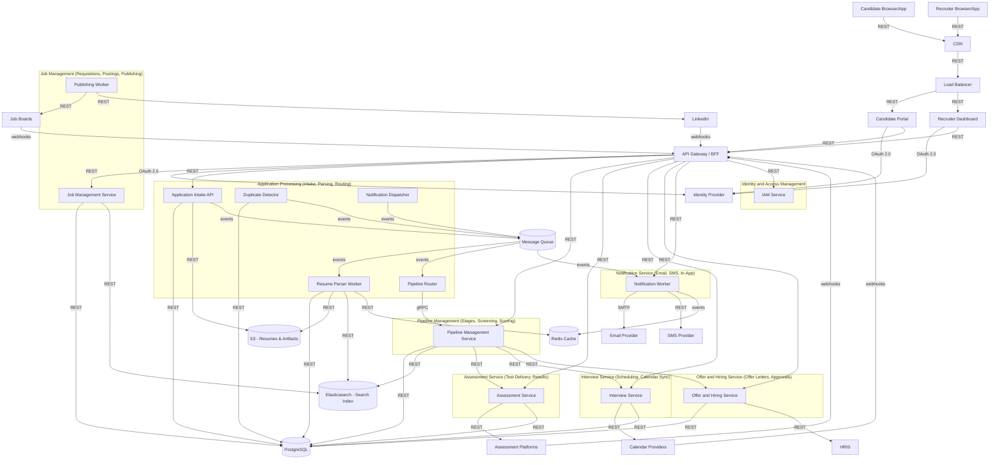

# LTI Applicant Tracking System (ATS) - Architecture

## 1) Architectural style (and why)

This design uses **domain-driven microservices** organized into **bounded contexts**, fronted by an **API Gateway / BFF**, and coordinated with **event-driven async workflows** (message queue + workers).  

Why it fits the constraints:
- **High read traffic on public job pages**: static assets and job-page read paths are placed behind **CDN + load balancer**, while search-heavy reads use **Elasticsearch** and fast caches via **Redis**.
- **Candidate PII security**: PII-heavy artifacts (e.g., resumes) are stored in **S3** and structured candidate/application data in **PostgreSQL**, with the **IAM + token-based access control** enforced at the gateway boundary.
- **Async processing for notifications + resume parsing**: long-running and failure-prone steps (resume parsing, notification dispatch) are handled by **queued `events` + workers**, reducing end-to-end latency and improving reliability.
- **Enterprise scalability**: each bounded context can scale independently (stateless services + separate datastores + queue backpressure).

[ASSUMPTION: At-rest encryption, strict RBAC, and audit logging are applied for PII in PostgreSQL and S3.]

## 2) Main services + responsibilities

The core services are grouped by bounded context:
- **Job Management**: manages requisitions, job postings, and publishing to external job sources.
- **Application Processing**: intake applications, enqueue parsing, enrich extracted data, deduplicate, and route applications to the right pipeline stage.
- **Pipeline Management**: manages stages, screening rules, progression logic, and orchestrates stage transitions.
- **Assessment Service**: creates and delivers assessments/tests, and ingests results.
- **Interview Service**: schedules interviews and syncs with external calendar providers.
- **Offer and Hiring Service**: generates offer letters, manages approvals, and performs HRIS onboarding updates.
- **Notification Service**: sends email/SMS/in-app notifications (confirmation, reminders, stage updates).
- **Identity and Access Management (IAM)**: authenticates and authorizes users via an external Identity Provider using `OAuth 2.0`.

## 3) Data flow across 7 lifecycle stages

1. **Requisition setup & posting preparation**
   - Recruiter/recruiter dashboard uses `REST` through the API Gateway/BFF to create/update requisitions and posting metadata.
   - **Job Management** persists definitions to **PostgreSQL** (`REST`) and prepares publishing configurations.

2. **Publishing to job boards and LinkedIn**
   - Job Management publishes postings to external job boards and LinkedIn using `REST` calls.
   - Job boards/LinkedIn may confirm or deliver status updates via `webhooks`.
   - Updated posting/search-ready documents are indexed into **Elasticsearch** (`REST`).

3. **Candidate application intake**
   - Candidates submit via the Candidate Portal using `REST`.
   - Job boards and LinkedIn forward new applications to ATS using `webhooks` to the API Gateway/BFF.
   - **Application Processing** stores application skeleton data in **PostgreSQL** (`REST`) and raw resume artifacts in **S3** (`REST`).

4. **Resume parsing & enrichment (async)**
   - Application Intake enqueues parsing jobs as `events` to the message queue.
   - Resume Parser worker consumes `events`, extracts structured data, and writes derived entities to **PostgreSQL** (`REST`).
   - Parsed artifacts and originals are retained in **S3** (`REST`), while searchable representations are updated in **Elasticsearch** (`REST`).
   - Useful intermediate results are cached in **Redis** (`REST`) to reduce repeated reads.

5. **Pipeline routing & screening**
   - Pipeline Router assigns the application to the correct stage using `gRPC`/`REST` to Pipeline Management.
   - Screening decisions produce stage updates persisted to **PostgreSQL** (`REST`) and reflected for recruiters via **Elasticsearch** (`REST`) where needed.
   - Pipeline transitions publish `events` for downstream services (e.g., assessment/interview readiness).

6. **Assessments + interview scheduling**
   - When a stage requires testing, Pipeline Management calls Assessment Service using `REST`.
   - Assessment Service triggers assessment delivery to assessment platforms using `REST`, and ingests results via `webhooks` back to ATS.
   - Interview Service schedules interviews with calendar providers using `REST`, while calendar updates flow back via `webhooks`.

7. **Offer & hiring completion + notifications**
   - Offer and Hiring Service generates offer letters and performs approval workflows, persisting state in **PostgreSQL** (`REST`).
   - On acceptance, it updates onboarding status in HRIS via `REST`.
   - Confirmation emails and stage notifications are dispatched asynchronously:
     - Notification Dispatcher emits `events` to the queue.
     - Notification workers send email via `SMTP`, and in-app/SMS alerts via `events`/`REST` to external providers.

## 4) External integrations

- **Job boards**: ATS publishes postings with `REST`; ATS receives candidate applications and/or publishing updates via `webhooks`.
- **LinkedIn**: ATS publishes to LinkedIn with `REST`; LinkedIn sends candidate application payloads via `webhooks`.
- **Email**: Notification Service sends email notifications via `SMTP`.
- **Calendar providers**: Interview Service schedules and syncs using `REST`, and receives changes via `webhooks`.
- **HRIS**: Offer and Hiring Service updates onboarding records via `REST`.
- **Assessment tools/platforms**: Assessment Service initiates tests via `REST` and receives test results via `webhooks`.
- **Identity Provider (IdP)**: IAM and API Gateway validate user access with `OAuth 2.0`.

## 5) Non-functional requirements (how the architecture addresses them)

- **High read traffic on public job pages**
  - CDN caching + load balancing for public pages.
  - Elasticsearch for fast search reads.
  - Redis caching to reduce repeated hot queries.

- **Candidate PII security**
  - Centralized auth boundary (IAM + API Gateway) using `OAuth 2.0`.
  - PII artifacts stored in S3; structured records in PostgreSQL.
  - [ASSUMPTION: PII encryption at rest, least-privilege access, and audit logs are enforced.]

- **Async processing for notifications + resume parsing**
  - Message queue holds `events` for parsing and notifications.
  - Workers are isolated per bounded context to improve throughput and resilience.

- **Enterprise scalability**
  - Horizontal scale per service and per worker type.
  - Backpressure via queue consumption rate.
  - Separation of transactional (PostgreSQL) and search/read-heavy (Elasticsearch) workloads.

## Mermaid architecture diagram

