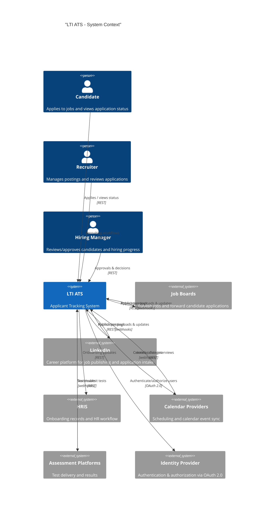
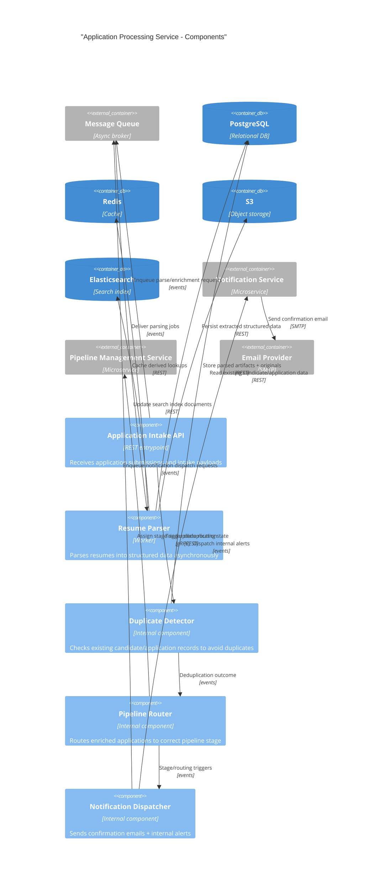

# LTI Applicant Tracking System (ATS) - C4 (Zoom: Application Processing)

## Level 1: System Context (C4Context)

This diagram shows the ATS in its business context: who uses it (Candidate, Recruiter, Hiring Manager) and how it integrates with external job sources, HRIS, calendar providers, assessment platforms, and the identity provider. The key design decision visible here is keeping external boundaries explicit and protocol-labeled (`REST`, `webhooks`, `OAuth 2.0`).

## Level 2: Container Diagram (C4Container)

```mermaid
C4Container
  title "LTI ATS - Containers (Application Processing in focus)"

  Person(candidate, "Candidate", "Browser/App")
  Person(recruiter, "Recruiter", "Browser/App")
  Person(hiringManager, "Hiring Manager", "Browser/App")

  Container(candidatePortal, "Candidate Portal", "Web UI", "Candidate-facing ATS UI")
  Container(recruiterDashboard, "Recruiter Dashboard", "Web UI", "Recruiter-facing ATS UI")
  Container(bff, "API Gateway / BFF", "Backend-for-Frontend", "Request routing + auth boundary")

  Container(appProcessing, "Application Processing Service", "Microservice", "Intake, parsing, deduplication, routing")
  Container(jobMgmt, "Job Management Service", "Microservice", "Requisitions, postings, publishing")
  Container(pipelineMgmt, "Pipeline Management Service", "Microservice", "Stages, screening, progression")
  Container(assessmentSvc, "Assessment Service", "Microservice", "Test delivery + results ingestion")
  Container(interviewSvc, "Interview Service", "Microservice", "Interview scheduling + calendar sync")
  Container(offerSvc, "Offer and Hiring Service", "Microservice", "Offer letters + approvals + HRIS updates")
  Container(notificationSvc, "Notification Service", "Microservice", "Email/SMS/In-app notifications")
  Container(iamSvc, "IAM Service", "Microservice", "OAuth 2.0 authorization + policy enforcement")

  ContainerDb(postgres, "PostgreSQL", "Relational DB", "Applications, candidates, requisitions")
  ContainerDb(redis, "Redis", "Cache", "Hot lookups and transient state")
  ContainerDb(s3, "S3", "Object storage", "Resume artifacts and parsed outputs")
  ContainerDb(es, "Elasticsearch", "Search", "Public job/search indexing and candidate search")

  Container(queue, "Message Queue", "Async broker", "Queued events for parsing + notifications")

  Container_Ext(jobBoards, "Job Boards", "External system")
  Container_Ext(linkedin, "LinkedIn", "External system")
  Container_Ext(hris, "HRIS", "External system")
  Container_Ext(calendar, "Calendar Providers", "External system")
  Container_Ext(assessments, "Assessment Platforms", "External system")
  Container_Ext(idp, "Identity Provider", "External system")

  Rel(candidate, candidatePortal, "Uses ATS UI", "REST")
  Rel(recruiter, recruiterDashboard, "Uses ATS UI", "REST")
  Rel(hiringManager, recruiterDashboard, "Approves/decides in ATS UI", "REST")

  Rel(candidatePortal, bff, "API requests", "REST")
  Rel(recruiterDashboard, bff, "API requests", "REST")
  Rel(bff, iamSvc, "OAuth2 token validation", "OAuth 2.0")
  Rel(iamSvc, idp, "Validate identities", "OAuth 2.0")

  %% Key zoom relationship
  Rel(bff, appProcessing, "Route intake + parsing triggers", "REST")
  Rel(appProcessing, queue, "Publish parsing/routing/notification events", "events")

  %% Other core services
  Rel(bff, jobMgmt, "Requisition/posting APIs", "REST")
  Rel(bff, pipelineMgmt, "Pipeline APIs", "REST")
  Rel(bff, assessmentSvc, "Assessment APIs", "REST")
  Rel(bff, interviewSvc, "Interview APIs", "REST")
  Rel(bff, offerSvc, "Offer/hiring APIs", "REST")
  Rel(bff, notificationSvc, "Notification APIs", "REST")

  %% Datastores
  Rel(jobMgmt, postgres, "Persist posting data", "REST")
  Rel(jobMgmt, es, "Index job documents", "REST")

  Rel(appProcessing, postgres, "Store application/candidate data", "REST")
  Rel(appProcessing, s3, "Store resumes/artifacts", "REST")
  Rel(appProcessing, es, "Update searchable representations", "REST")
  Rel(appProcessing, redis, "Cache hot lookups", "REST")

  Rel(pipelineMgmt, postgres, "Persist pipeline state", "REST")
  Rel(pipelineMgmt, es, "Expose read-optimized views", "REST")

  Rel(assessmentSvc, postgres, "Persist assessment results", "REST")
  Rel(interviewSvc, postgres, "Persist interview scheduling state", "REST")
  Rel(offerSvc, postgres, "Persist offers/approvals", "REST")

  %% External integrations (protocol-labeled)
  Rel(jobMgmt, jobBoards, "Publish jobs", "REST")
  Rel(linkedin, appProcessing, "Inbound application payloads", "webhooks")
  Rel(jobBoards, appProcessing, "Inbound application payloads", "webhooks")

  Rel(jobMgmt, linkedin, "Publish jobs", "REST")

  Rel(assessmentSvc, assessments, "Start tests", "REST")
  Rel(assessments, assessmentSvc, "Test results", "webhooks")

  Rel(interviewSvc, calendar, "Create/update interviews", "REST")
  Rel(calendar, interviewSvc, "Calendar changes", "webhooks")

  Rel(offerSvc, hris, "Onboarding updates", "REST")
```

This diagram shows the major containers and their responsibilities, with special emphasis on the **Application Processing Service** and its integration points (API Gateway/BFF and the message queue). The key design decisions visible are clear bounded-context separation and explicit async event coordination between intake/parsing/routing and notification flows.

## Level 3: Component Diagram (C4Component) - Application Processing Service

This diagram zooms into the Application Processing Service and makes the internal pipeline explicit: intake accepts payloads, parsing is performed asynchronously via queued `events`, deduplication guards data quality, routing delegates progression to Pipeline Management, and notification dispatch is triggered as a downstream async dependency. The key visible design decision is isolating heavy/slow work (parsing) behind the queue while keeping the intake API responsive.

