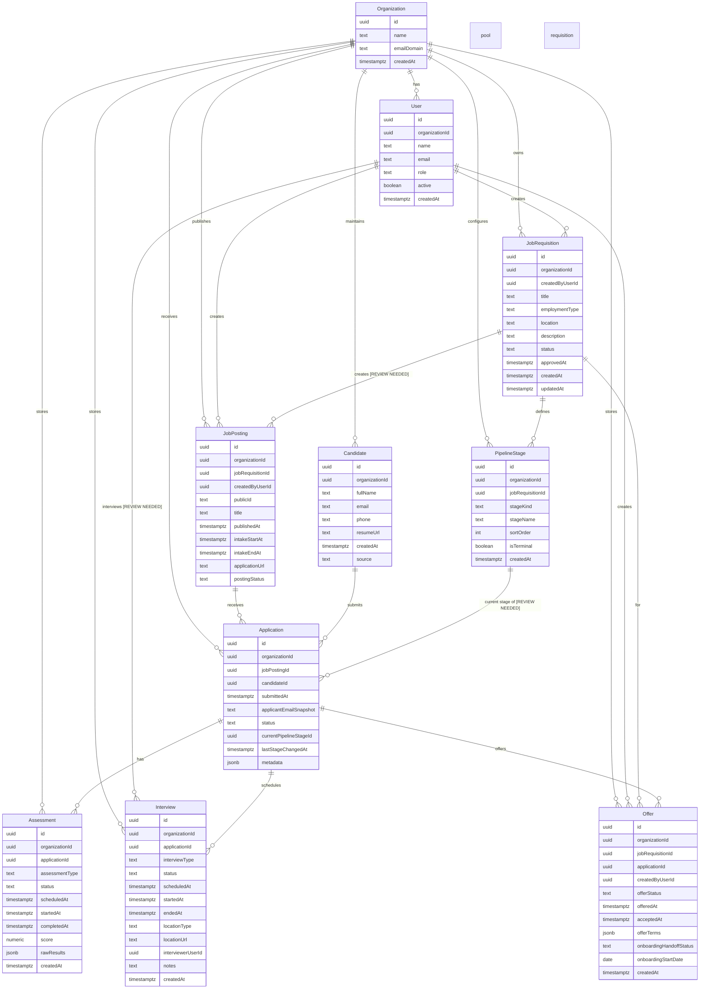

# LTI Applicant Tracking System (ATS) - Data Model

This data model covers the end-to-end lifecycle:
`requisitions -> publishing -> intake -> reviewing/screening -> online assessments -> interview scheduling/running -> hiring (offer -> onboarding handoff)`.

## Entities

### Organization
**Key fields**
- `id uuid` (PK)
- `name text`
- `emailDomain text`
- `createdAt timestamptz`

**Relationships (with cardinality)**
- `Organization` (1) -- (N) `User`: organization users who operate the ATS
- `Organization` (1) -- (N) `JobRequisition`: organization owns requisitions
- `Organization` (1) -- (N) `JobPosting`: organization publishes postings
- `Organization` (1) -- (N) `Candidate`: organization owns the candidate pool
- `Organization` (1) -- (N) `Application`: all applications belong to the organization
- `Organization` (1) -- (N) `PipelineStage`: stages are defined per requisition/pipeline within the organization
- `Organization` (1) -- (N) `Assessment`: all assessment events belong to the organization
- `Organization` (1) -- (N) `Interview`: all interviews belong to the organization
- `Organization` (1) -- (N) `Offer`: all offers belong to the organization

**Business purpose (1 sentence)**
- Represents the employing organization that configures and runs the ATS workflow.

### User
**Key fields**
- `id uuid` (PK)
- `organizationId uuid` (FK)
- `name text`
- `email text`
- `role text` (e.g., `RECRUITER`, `SCREENING_MANAGER`, `INTERVIEWER`)
- `active boolean`
- `createdAt timestamptz`

**Relationships (with cardinality)**
- `Organization` (1) -- (N) `User`
- `User` (1) -- (N) `JobRequisition` (createdByUserId)
- `User` (1) -- (N) `JobPosting` (createdByUserId)
- `User` (1) -- (N) `Interview` (interviewerUserId) [REVIEW NEEDED]
- `User` (1) -- (N) `Offer` (createdByUserId)

**Business purpose (1 sentence)**
- Represents internal ATS users who create requisitions, manage pipeline flow, and run interviews.

### JobRequisition
**Key fields**
- `id uuid` (PK)
- `organizationId uuid` (FK)
- `createdByUserId uuid` (FK)
- `title text`
- `employmentType text` (e.g., `FULL_TIME`, `PART_TIME`, `CONTRACT`)
- `location text`
- `description text`
- `status text` (e.g., `DRAFT`, `IN_REVIEW`, `APPROVED`, `PUBLISHED`, `CLOSED`)
- `approvedAt timestamptz`
- `createdAt timestamptz`
- `updatedAt timestamptz`

**Relationships (with cardinality)**
- `Organization` (1) -- (N) `JobRequisition`
- `User` (1) -- (N) `JobRequisition` (createdByUserId)
- `JobRequisition` (1) -- (N) `JobPosting` [REVIEW NEEDED]
- `JobRequisition` (1) -- (N) `PipelineStage`

**Business purpose (1 sentence)**
- Captures the internal request to open a role and defines the pipeline stages for that requisition.

### JobPosting
**Key fields**
- `id uuid` (PK)
- `organizationId uuid` (FK)
- `jobRequisitionId uuid` (FK)
- `createdByUserId uuid` (FK)
- `publicId text` (public-facing identifier/slug)
- `title text`
- `publishedAt timestamptz`
- `intakeStartAt timestamptz`
- `intakeEndAt timestamptz`
- `applicationUrl text`
- `postingStatus text` (e.g., `PUBLISHED`, `PAUSED`, `CLOSED`)

**Relationships (with cardinality)**
- `Organization` (1) -- (N) `JobPosting`
- `JobRequisition` (1) -- (N) `JobPosting` [REVIEW NEEDED]
- `User` (1) -- (N) `JobPosting` (createdByUserId)
- `JobPosting` (1) -- (N) `Application`

**Business purpose (1 sentence)**
- Represents the external/public listing created from a requisition for candidates to submit applications.

### Candidate
**Key fields**
- `id uuid` (PK)
- `organizationId uuid` (FK)
- `fullName text`
- `email text`
- `phone text`
- `resumeUrl text`
- `createdAt timestamptz`
- `source text` (e.g., `DIRECT`, `REFERRED`, `PARTNER`)

**Relationships (with cardinality)**
- `Organization` (1) -- (N) `Candidate`
- `Candidate` (1) -- (N) `Application`

**Business purpose (1 sentence)**
- Represents a person in the ATS who can submit one or more applications.

### Application
**Key fields**
- `id uuid` (PK)
- `organizationId uuid` (FK)
- `jobPostingId uuid` (FK)
- `candidateId uuid` (FK)
- `submittedAt timestamptz`
- `applicantEmailSnapshot text` (snapshot for auditing)
- `status text` (e.g., `SUBMITTED`, `IN_SCREENING`, `IN_ASSESSMENT`, `INTERVIEW_SCHEDULED`, `OFFERED`, `HIRED`, `REJECTED`)
- `currentPipelineStageId uuid` (FK, nullable)
- `lastStageChangedAt timestamptz`
- `metadata jsonb`

**Relationships (with cardinality)**
- `Organization` (1) -- (N) `Application`
- `JobPosting` (1) -- (N) `Application`
- `Candidate` (1) -- (N) `Application`
- `PipelineStage` (1) -- (N) `Application` (currentPipelineStageId) [REVIEW NEEDED]
- `Application` (1) -- (N) `Assessment`
- `Application` (1) -- (N) `Interview`
- `Application` (1) -- (N) `Offer`

**Business purpose (1 sentence)**
- Represents a candidate submission to a job posting and tracks the progression through pipeline stages.

### PipelineStage
**Key fields**
- `id uuid` (PK)
- `organizationId uuid` (FK)
- `jobRequisitionId uuid` (FK)
- `stageKind text` (e.g., `INTAKE`, `SCREENING`, `ONLINE_ASSESSMENT`, `INTERVIEW`, `OFFER`, `HIRED`, `ONBOARDING_HANDOFF`)
- `stageName text`
- `sortOrder int`
- `isTerminal boolean`
- `createdAt timestamptz`

**Relationships (with cardinality)**
- `Organization` (1) -- (N) `PipelineStage`
- `JobRequisition` (1) -- (N) `PipelineStage`
- `PipelineStage` (1) -- (N) `Application` (currentPipelineStageId) [REVIEW NEEDED]

**Business purpose (1 sentence)**
- Defines the configured workflow stages used to guide applications through screening, assessments, interviews, and hiring.

### Assessment
**Key fields**
- `id uuid` (PK)
- `organizationId uuid` (FK)
- `applicationId uuid` (FK)
- `assessmentType text` (e.g., `ONLINE_TEST`, `CODING_EXERCISE`, `PRE_SCREEN_QUIZ`)
- `status text` (e.g., `SCHEDULED`, `IN_PROGRESS`, `COMPLETED`, `CANCELLED`)
- `scheduledAt timestamptz`
- `startedAt timestamptz`
- `completedAt timestamptz`
- `score numeric`
- `rawResults jsonb`
- `createdAt timestamptz`

**Relationships (with cardinality)**
- `Organization` (1) -- (N) `Assessment`
- `Application` (1) -- (N) `Assessment`

**Business purpose (1 sentence)**
- Represents an online assessment instance tied to an application and stores results for downstream decisions.

### Interview
**Key fields**
- `id uuid` (PK)
- `organizationId uuid` (FK)
- `applicationId uuid` (FK)
- `interviewType text` (e.g., `PHONE_SCREEN`, `TECHNICAL`, `HR`, `PANEL`)
- `status text` (e.g., `SCHEDULED`, `RUNNING`, `COMPLETED`, `CANCELLED`, `NO_SHOW`)
- `scheduledAt timestamptz`
- `startedAt timestamptz`
- `endedAt timestamptz`
- `locationType text` (e.g., `VIRTUAL`, `ONSITE`)
- `locationUrl text`
- `interviewerUserId uuid` (FK nullable) [REVIEW NEEDED]
- `notes text`
- `createdAt timestamptz`

**Relationships (with cardinality)**
- `Organization` (1) -- (N) `Interview`
- `Application` (1) -- (N) `Interview`
- `User` (1) -- (N) `Interview` (interviewerUserId) [REVIEW NEEDED]

**Business purpose (1 sentence)**
- Represents a scheduled interview event (and its running/completion metadata) for a candidate application.

### Offer
**Key fields**
- `id uuid` (PK)
- `organizationId uuid` (FK)
- `jobRequisitionId uuid` (FK)
- `applicationId uuid` (FK)
- `createdByUserId uuid` (FK)
- `offerStatus text` (e.g., `DRAFT`, `EXTENDED`, `ACCEPTED`, `DECLINED`, `WITHDRAWN`)
- `offeredAt timestamptz`
- `acceptedAt timestamptz`
- `offerTerms jsonb`
- `onboardingHandoffStatus text` (e.g., `NOT_STARTED`, `PENDING`, `COMPLETED`)
- `onboardingStartDate date`
- `createdAt timestamptz`

**Relationships (with cardinality)**
- `Organization` (1) -- (N) `Offer`
- `User` (1) -- (N) `Offer` (createdByUserId)
- `Application` (1) -- (N) `Offer`
- `JobRequisition` (1) -- (N) `Offer`

**Business purpose (1 sentence)**
- Represents the final hiring offer (and onboarding handoff state) for an application.

## Mermaid ER Diagram

## Summary Table

| Entity | Business Purpose | Key Relationships |
|---|---|---|
| `JobRequisition` | Defines the internal role request and pipeline configuration. | `Organization` (1..N), `User` (1..N), `JobPosting` (1..N) [REVIEW NEEDED], `PipelineStage` (1..N) |
| `JobPosting` | Represents the published listing and intake window for candidates. | `Organization` (1..N), `JobRequisition` (1..N) [REVIEW NEEDED], `Application` (1..N) |
| `Application` | Tracks a candidate submission and its progression through stages. | `JobPosting` (1..N), `Candidate` (1..N), `PipelineStage` (current, 1..N) [REVIEW NEEDED], `Assessment` (1..N), `Interview` (1..N), `Offer` (1..N) |
| `Candidate` | Represents the person applying to job postings. | `Organization` (1..N), `Application` (1..N) |
| `PipelineStage` | Models the pipeline workflow stages for screening/assessment/interviewing/hiring. | `Organization` (1..N), `JobRequisition` (1..N), `Application` current stage (1..N) [REVIEW NEEDED] |
| `Assessment` | Stores online assessment instances and results per application. | `Organization` (1..N), `Application` (1..N) |
| `Interview` | Stores interview scheduling and execution metadata per application. | `Organization` (1..N), `Application` (1..N), `User` (1..N) [REVIEW NEEDED] |
| `Offer` | Stores offer state and onboarding handoff status after hiring selection. | `Organization` (1..N), `JobRequisition` (1..N), `Application` (1..N), `User` (1..N) |
| `User` | Represents ATS internal operator(s). | `Organization` (1..N), `JobRequisition` (1..N), `JobPosting` (1..N), `Interview` (1..N) [REVIEW NEEDED], `Offer` (1..N) |
| `Organization` | Represents the employing organization running ATS workflows. | `User` (1..N), `JobRequisition` (1..N), `JobPosting` (1..N), `Candidate` (1..N), `Application` (1..N), `PipelineStage` (1..N), `Assessment` (1..N), `Interview` (1..N), `Offer` (1..N) |

