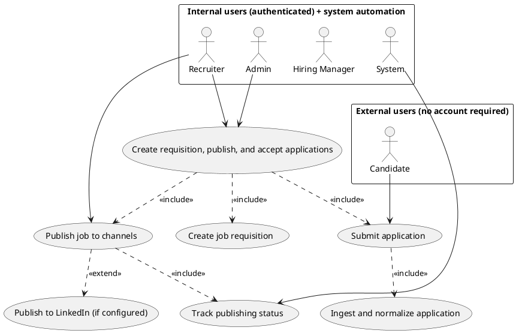
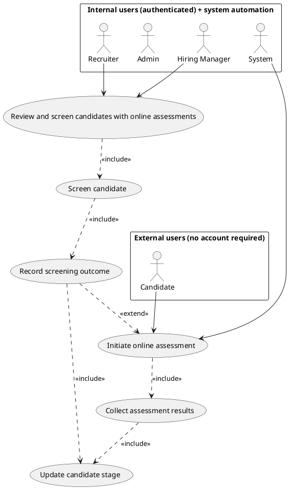
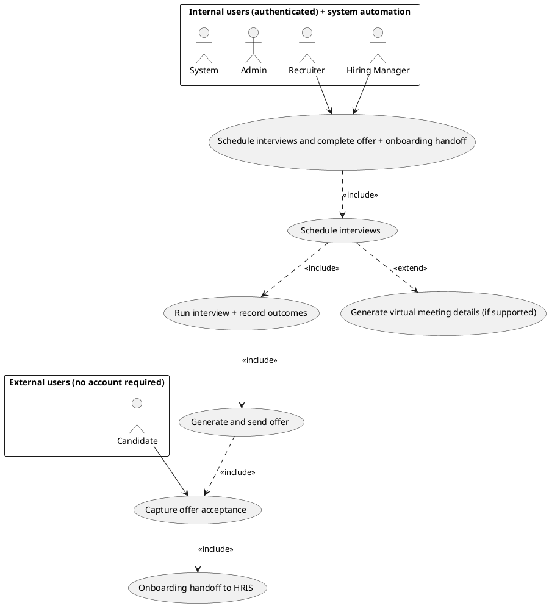

# LTI Applicant Tracking System (ATS) Use Cases (First Release)

This document describes the three most impactful use cases for the first release of the LTI Applicant Tracking System (ATS), aligned to the seven recruiting lifecycle stages provided in the prompt.

## Use Case 1: Create Job Requisition, Publish Jobs, and Accept Applications

Create and configure a job requisition, publish it to selected channels (job boards/website/social including LinkedIn), and receive candidate applications into the ATS pipeline.

### Actors

Primary actor (internal authenticated): `Recruiter`
Secondary actors (internal authenticated): `Hiring Manager`, `Admin`, `System`
Secondary actor (external, no account required): `Candidate`

### Preconditions

1. Recruiter has permission to create job requisitions.
2. At least one publishing channel is configured for the enterprise (job boards, website/social, and optionally LinkedIn).
3. Candidate access is enabled for application submission (no internal account required).

### Postconditions

1. Job requisition is saved and a job posting is published to selected channels.
2. Candidate applications are received and normalized into the ATS for downstream review/screening.

### Main Flow

1. `Recruiter` creates a job requisition in LTI (stage 1).
2. `Recruiter` configures the publishing scope (stage 2), selecting channels including LinkedIn if configured.
3. `System` validates required requisition fields and generates posting content.
4. `System` publishes the job posting to selected channels and tracks publishing status.
5. `Candidate` views the published job listing and starts the application (external flow, no account required).
6. `Candidate` submits an application form.
7. `System` stores the application, associates it to the correct requisition, and notifies the recruiter/hiring team.

### Alternative / Exception Flows

1. Application validation failure: if required application fields are missing or invalid, the candidate is prompted to correct them; submission is not recorded until valid.
2. Channel publishing error: if a job board/social channel rejects publication, `System` surfaces the failure and marks the job posting as partially published until resolved.
3. Duplicate application: if an application appears to be a duplicate, `System` flags it for recruiter review instead of creating a new entry.
4. LinkedIn posting not available: if LinkedIn integration is not configured or throttled, `System` posts to remaining channels and logs the LinkedIn failure.

### PlantUML Use Case Diagram

## Use Case 2: Review and Screen Candidates with Online Assessments

Review and screen incoming candidates, initiate online assessments for selected candidates, collect results from the assessment provider, and update candidate stage decisions.

### Actors

Primary actor (internal authenticated): `Recruiter`
Secondary actors (internal authenticated): `Hiring Manager`, `Admin`, `System`
Secondary actor (external, no account required): `Candidate`

### Preconditions

1. A job requisition exists with an active screening pipeline.
2. Candidate applications have been received for that requisition.
3. Online assessment capability is enabled for the enterprise or configured for the specific requisition. [ASSUMPTION: assessment tools expose a results integration or callback that LTI can record.]

### Postconditions

1. Screening outcomes are recorded (advance, request assessment, reject).
2. Assessment status and results are attached to candidate profiles for recruiter/hiring manager review.

### Main Flow

1. `Recruiter` and/or `Hiring Manager` reviews candidates in the ATS (stage 4).
2. `System` presents candidates and supports applying the configured screening criteria.
3. `Recruiter` records a screening decision (for example: advance to interview, request assessment, or reject).
4. If an online assessment is required, `System` initiates the assessment workflow for the selected candidate (stage 5).
5. `Candidate` completes the assessment via the provided assessment link.
6. `System` collects assessment results and attaches them to the candidate record.
7. `Recruiter` and/or `Hiring Manager` reviews assessment results and updates the candidate stage status accordingly.

### Alternative / Exception Flows

1. Screening criteria incomplete: if screening criteria are not configured or insufficient, `System` blocks advancing and requests completion of required screening settings.
2. Assessment initiation failure: if `System` cannot create an assessment session, it marks the candidate as "assessment pending" and alerts the recruiter.
3. Candidate assessment timeout: if the candidate does not complete the assessment within the configured deadline, `System` records the attempt and sets a retry/exception status for recruiter action.
4. Results retrieval failure: if results cannot be fetched from the provider, `System` stores the error state and keeps the candidate in "results pending" until resolved.

### PlantUML Use Case Diagram

## Use Case 3: Schedule Interviews and Complete Offer + Onboarding Handoff

Select candidates for interviews, schedule and run interviews using calendar integration, record interview outcomes, generate and send hiring offers, and trigger onboarding handoff to HRIS for accepted applicants.

### Actors

Primary actor (internal authenticated): `Recruiter`
Secondary actors (internal authenticated): `Hiring Manager`, `Admin`, `System`
Secondary actor (external, no account required): `Candidate`

### Preconditions

1. Candidates are selected for interviews based on screening and assessment results.
2. Calendar integration is configured for the enterprise. [ASSUMPTION: LTI can create calendar events and attach meeting details/links via the integration.]
3. HRIS onboarding handoff is configured for accepted candidates.

### Postconditions

1. Interview sessions are scheduled and communicated to all relevant internal participants.
2. Candidate hiring decision is completed with offer delivery and an acceptance/decline captured.
3. For accepted candidates, LTI triggers onboarding handoff to HRIS and notifies internal teams.

### Main Flow

1. `Recruiter` selects candidates for interviews and proposes an interview plan.
2. `System` schedules interview sessions via calendar integration (stage 6) and sends calendar invites.
3. `Recruiter` coordinates interview execution and records interview outcomes.
4. `System` consolidates interview outcomes and updates candidate decision status.
5. `Recruiter` generates and sends an offer to the selected candidate.
6. `Candidate` accepts or declines the offer.
7. For accepted offers, `System` triggers onboarding handoff to HRIS (stage 7) and notifies HR/admin teams.

### Alternative / Exception Flows

1. Scheduling conflict: if requested interview slots are unavailable, `System` proposes alternative times; recruiter selects and retries scheduling.
2. Candidate declines offer: `System` records the decline and marks candidate as "not hired"; recruiter can move to next selected candidate.
3. Interview outcome missing: if interviews were completed but outcomes are not recorded, `System` blocks offer generation and requires completion of required outcome fields.
4. HRIS handoff failure: if onboarding handoff fails, `System` records the failure state and retries or escalates to `Admin`.

### PlantUML Use Case Diagram

